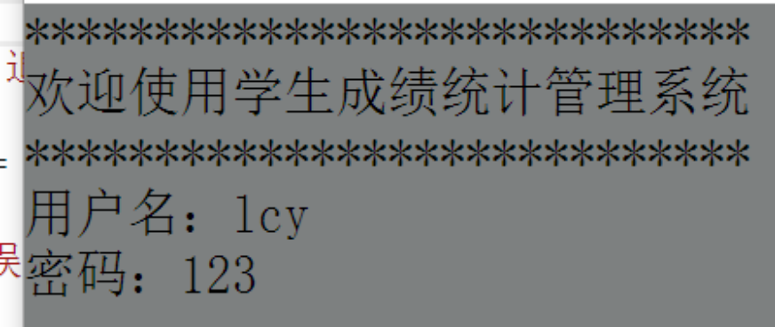
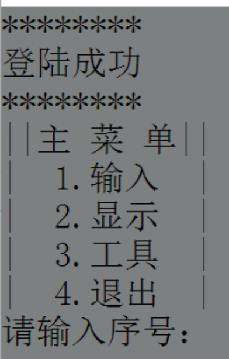
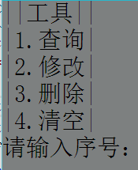
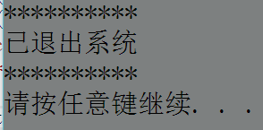
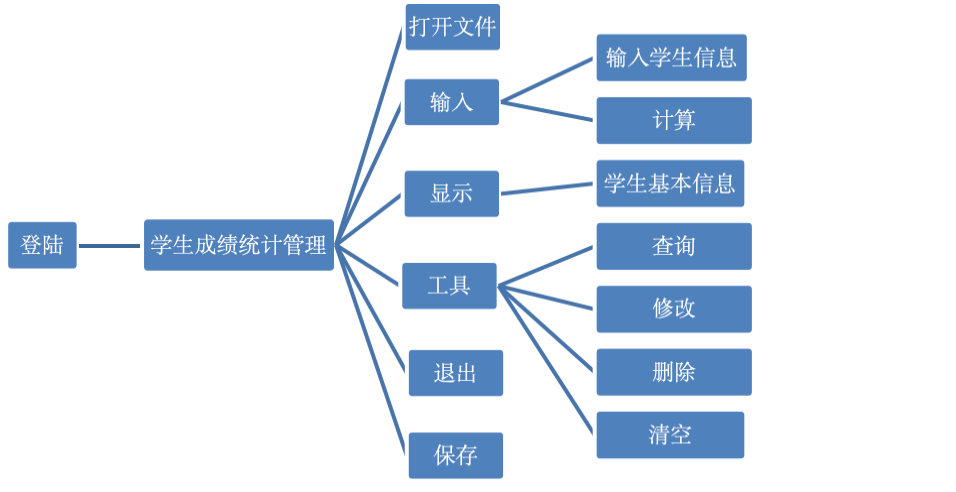

# StudentGradeManagementSystem
# 程序概述
## 程序名称：学生成绩统计管理
## 主要功能：
1. 有登陆界面（需输入用户名（lcy）/密码（123）进入系统），如果输错3次，会自动退出系统。

2. 运行时有菜单界面。

3. 打开一个Student Datebase.txt文件，若文档中没有此文件，则自动建立一个同名文件。
4. 输入一个班级的学生的基本信息（包括学号，姓名，性别，5门课程成绩）。
5. 根据输入的学生基本信息计算每个学生总分、平均分。
6. 计算各科平均分。
7. 对所有学生按总分排名次，输出每个学生的基本信息及总分、平均分和名次。输出学生基本信息、总分、平均分、低于科目平均分的、单科高于90、低于60的学生的信息。

8. 工具（按学号/姓名）

    1. 查询：输出所有该生基本信息。
    2. 修改：修改所有该生基本信息。
    3. 删除：删除所有该生基本信息。
    4. 清空：清空所有学生基本信息。
9. 如果输入错误，会有提示，再次输入。
10. 退出时，能够加密保存到记事本，以供下次使用。

# 程序总体结构

# 算法主要思想
1. 进入登陆页面，输入用户名及密码，若有错误，重新输入，若超过3次，自动退出系统。
2. 登陆成功，主菜单有4个选项，输入序号，进入不同页面。
    1. 输入:输入学生等基本信息，继续或停止输入，并计算总分于平均分。
    2. 显示：显示所有学生的基本信息、总分、平均分、名次、低于科目平均分的学生信息、单科成绩高于90或低于60分的学生信息。
    3. 工具（按学生学号或姓名）：
        1. 查询:显示需要查询的学生信息。
        2. 修改:修改需要查询的学生信息。
        3. 删除:删除需要查询的学生信息。
        4. 清空:清空需要查询的学生信息。
3. 退出并保存。

# 总结
## 优点：
1. 程序结构简洁、紧凑、可更改运行界面颜色、规整、表达式简练、使用灵活、人性化（若出现错误，会有声音提示），提示到位。
2. 程序可读性强、检索迅速、查找方便、存储量大、效率高、界面清晰、简约大方、实用性强。
3. 可进行加密存储，发挥数据系统应有的特点，以便下次使用。
## 缺点:
1. 部分算法没有进行优化，存在可能不需要的语句。
2. 操作较复杂，只能键盘输入，不能鼠标点击。
3. 存储文件不能改名。
4. 功能有限，存储量较小。
5. 无法脱离编译器，包装成软件进行下载。
## 收获: 
通过这次编写学生成绩统计管理系统，拓宽了C语言知识面，锻炼了编程能力，进行了一次理论与实践相结合的全新尝试，提高了分析、解决问题的能力。由于此次编程所涉及的知识点很多，使我们所学的理论知识得到较为系统全面的梳理，对C语言有了更深入的了解（如了解到数据要怎样存储，并且怎样读取，调用什么函数），为以后的学习与将来工作打下了良好的基础。从课堂走向实践，找出了在学习中的不足和薄弱环节，起到了查漏补缺，巩固旧知识、学习新知识的作用。